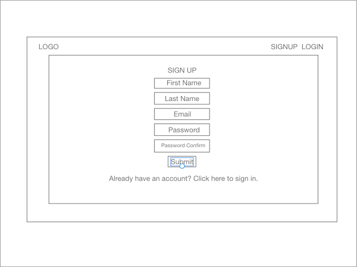
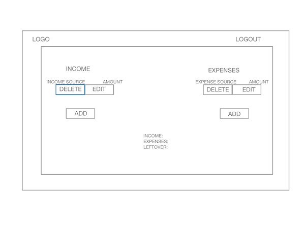

# BudgetVue

### Core Functionality
- User will be able to register/login
- User will be able to add/delete/edit sources of income
- User will be able to add/delete/edit expenses
- User will be able tp view income and expenses in list view
- User will be able to see how much money they have remaining based on income and expenses
  
### Technologies
- Rails
- React
- React-Router-Dom 
- JWT
- Bcrypt
- Bootstrap
- Axios
  

### Feature Delivery

#### Monday, 8/12
- App scaffold complete
- Database modeling complete with associations

#### Tuesday 8/13
- Main components complete(income, expenses, summary)
- User authentication feature complete
  
#### Wednesday 8/14
- Core functionality complete

#### Thursday 8/15
- Styling complete 
- MVP complete (Full CRUD, user authentication, user authorization, implemented with react-router-dom)
  
### Entity Relationship Diagram

### Wireframes
- Log In Page

- Sign Up Page

- Home Page

- View Income Source Page

- Add Income Source Page

- Add Income Source Entry

- View Expense Source Page

- Add Expense Source Page

- Add Expense Source Entry Page

